# PR #6771 Visual Verification — Tab-Route Navigation

Screenshots captured from `localhost:4010` across multiple cluster environments.

---

## Tab-Route Pages

### `/ai-hub/models` (redirects to `/ai-hub/models/catalog`)
Confirmed redirect. "Models" page title with 3-tab bar: Catalog / Registry / Deployments.

### `/ai-hub/models/catalog` — Catalog tab active
Model Catalog renders with 3-tab bar.

### `/ai-hub/models/registry` — Registry tab active
Model Registry renders, Registry tab highlighted.

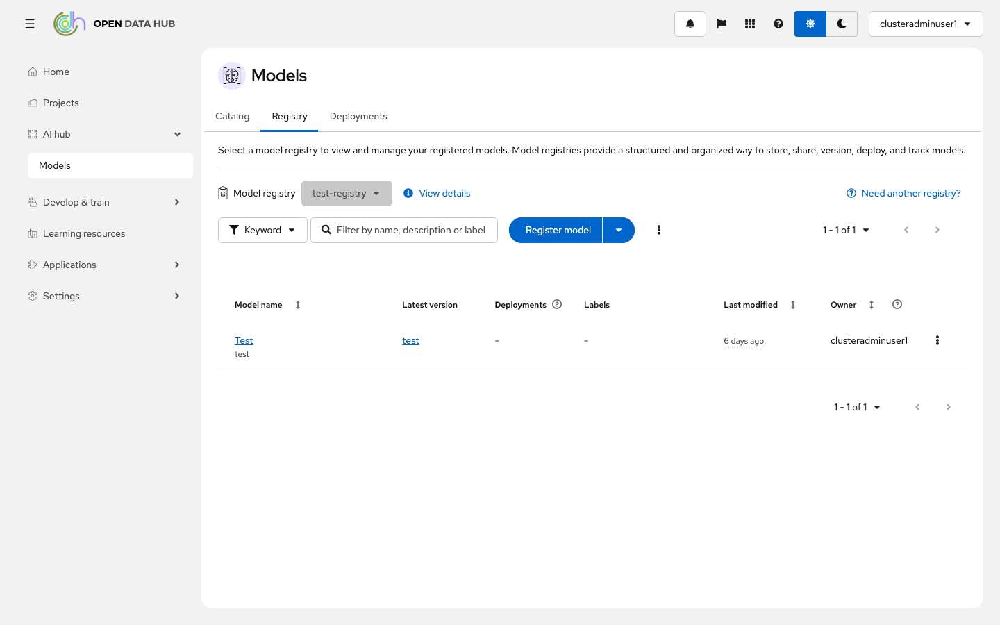

### `/ai-hub/models/deployments` — Deployments tab active
Deployments renders, Deployments tab highlighted.

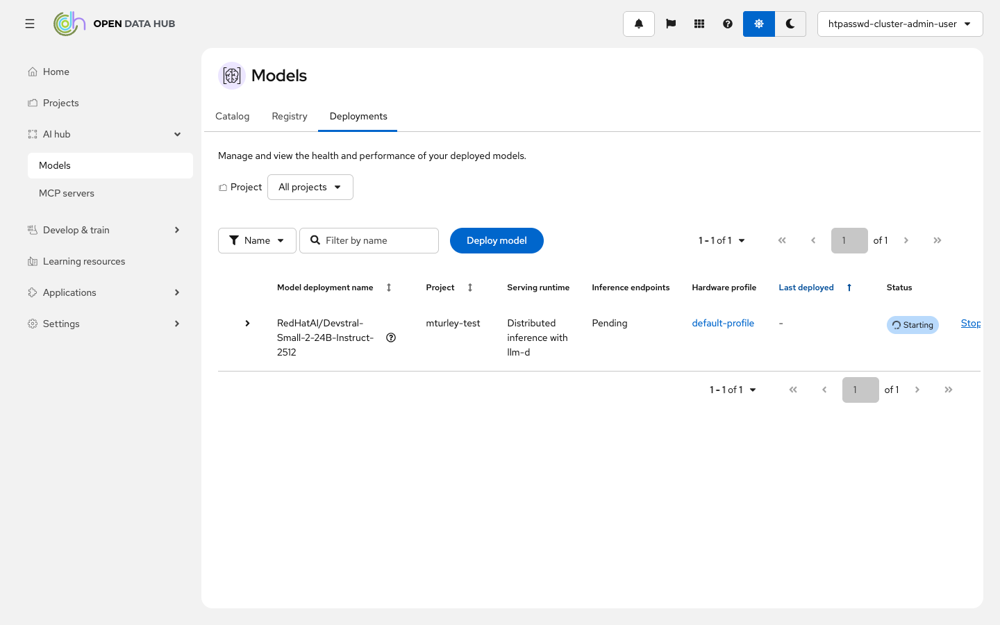

### `/ai-hub/mcp-servers` (redirects to `/ai-hub/mcp-servers/catalog`)
Confirmed redirect. "MCP servers" page title with 2-tab bar: Catalog / Deployments.

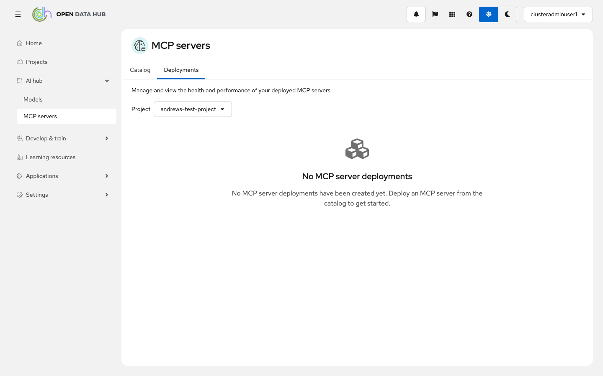

### `/ai-hub/mcp-servers/catalog` — Catalog tab active
MCP Catalog renders with 2-tab bar.

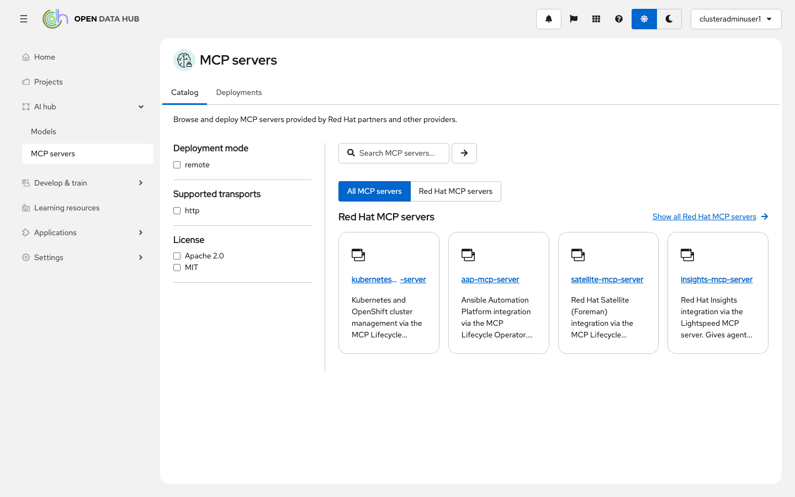

### `/ai-hub/mcp-servers/deployments` — Deployments tab active
MCP Deployments renders, Deployments tab highlighted. No redundant title (suppressed via `noTitle`).

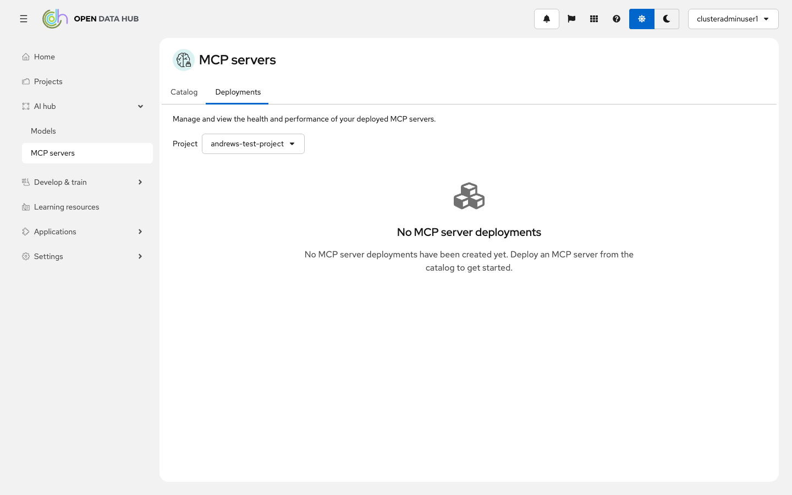

---

## Old URL Redirects

All redirects confirmed working:

| Old URL | Redirects To | Screenshot |
|---------|-------------|------------|
| `/ai-hub/catalog` | `/ai-hub/models/catalog` | 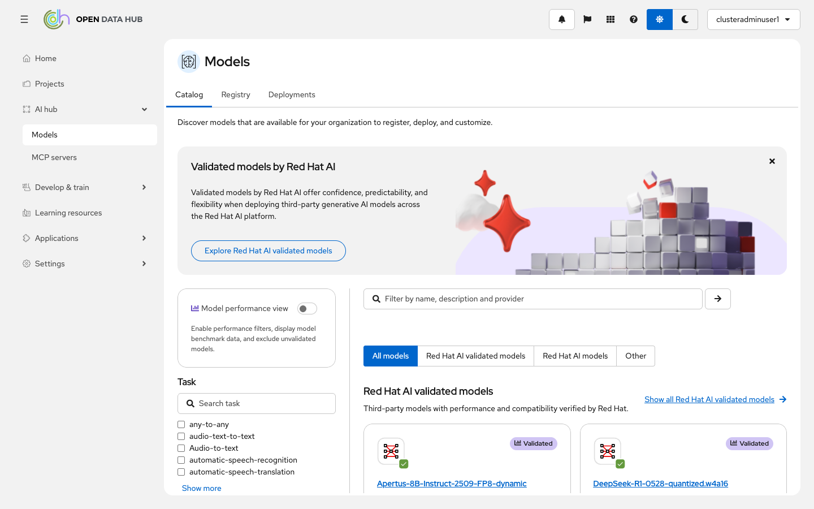 |
| `/ai-hub/registry` | `/ai-hub/models/registry/test-registry` |  |
| `/ai-hub/deployments` | `/ai-hub/models/deployments` | 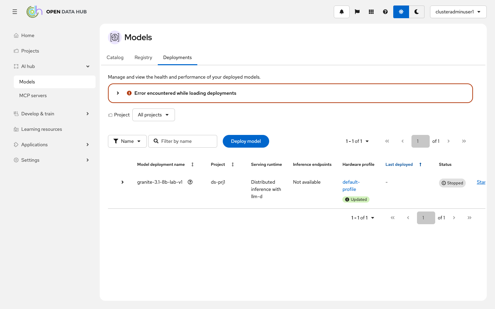 |
| `/ai-hub/mcp-catalog` | `/ai-hub/mcp-servers/catalog` |  |
| `/ai-hub/mcp-deployments` | `/ai-hub/mcp-servers/deployments` |  |
| `/modelServing` | `/ai-hub/models/deployments` |  |

---

## Invalid Tab Handling

### `/ai-hub/models/nonexistent-tab`
Redirects to last-visited tab (session storage). In this case it went to `/ai-hub/models/deployments` because that was the most recently visited tab.

### `/ai-hub/mcp-servers/nonexistent-tab`
Redirects to `/ai-hub/mcp-servers/catalog` (default tab).

---

## Sub-Pages

### Model Catalog Detail — `/ai-hub/models/catalog/{source}/{model}`
"Models" title with tab bar above, breadcrumb "Catalog > model-name" below. Catalog tab active.

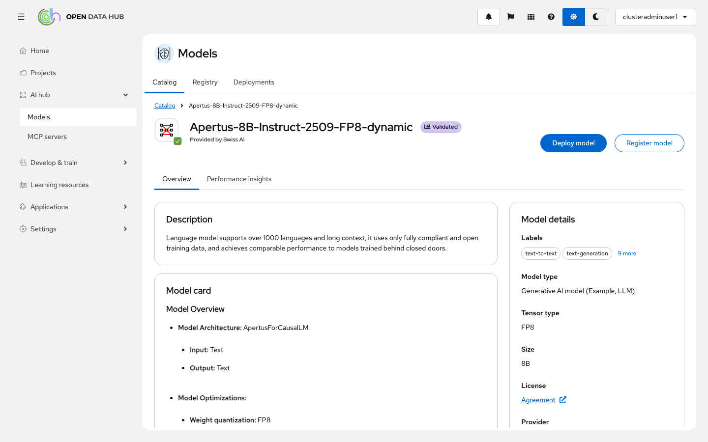

### Registry Detail — `/ai-hub/models/registry/{registry-name}`
"Models" title, Registry tab active, registry content with model table.

### Registered Model — `/ai-hub/models/registry/{registry}/registered-models/{id}`
"Models" title, Registry tab active, breadcrumb "Model registry - test-registry > Test".

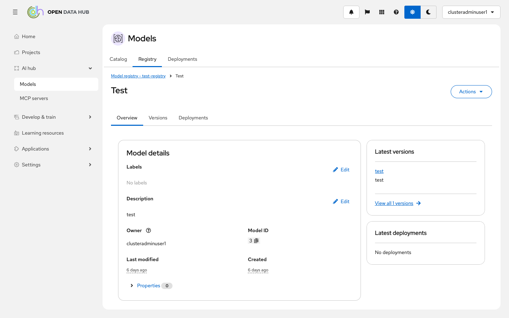

### Model Version — `/ai-hub/models/registry/{registry}/registered-models/{id}/versions/{vid}`
Breadcrumb "Model registry - test-registry > Test > test", Registry tab active.

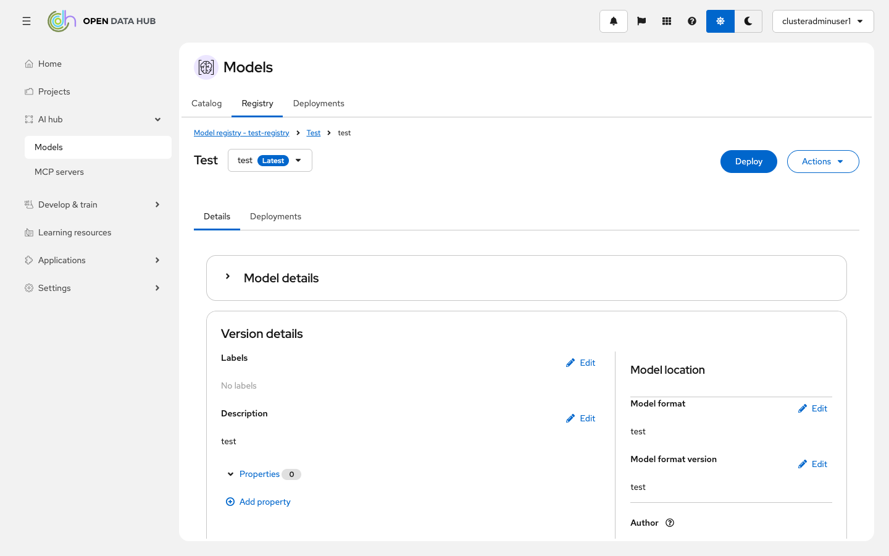

### Namespace-Scoped Deployments — `/ai-hub/models/deployments/{namespace}`
Deployments tab active, project selector showing namespace.

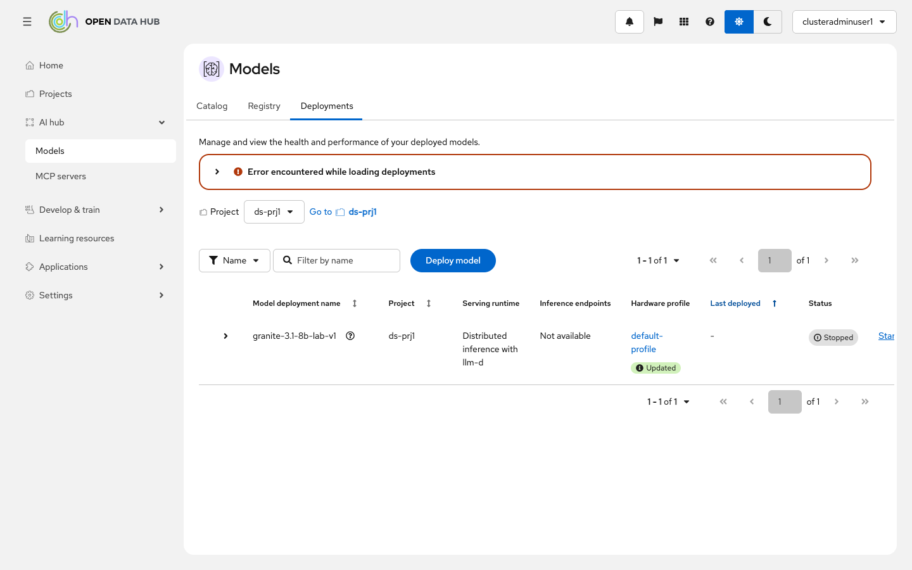

### Deploy Wizard — `/ai-hub/models/deployments/deploy`
Deploy wizard renders with step navigation. No tab bar on this page.

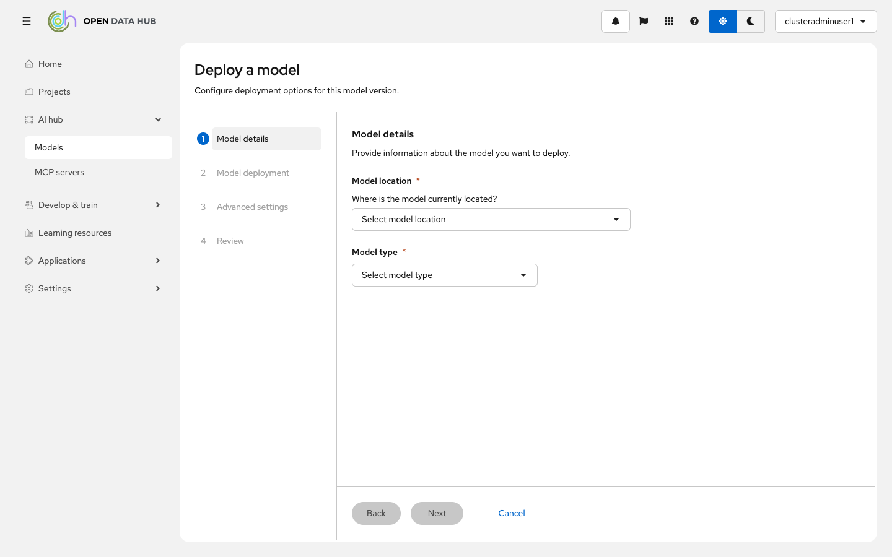

### MCP Server Detail — `/ai-hub/mcp-servers/catalog/{id}`
"MCP servers" title with tab bar (Catalog / Deployments), breadcrumb "MCP Catalog > kubernetes-mcp-server".

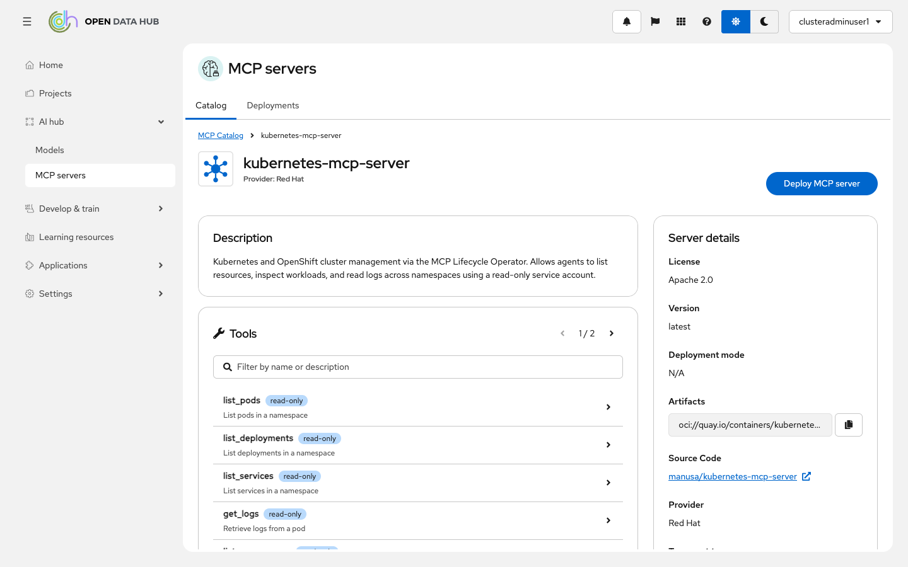

### Metrics Page — `/ai-hub/models/deployments/{namespace}/metrics/{name}`
"Models" title, breadcrumb "Deployments > s3 tewst", metrics charts rendered. No tab bar on this sub-page.
*(Captured on a different cluster with a deployed model.)*

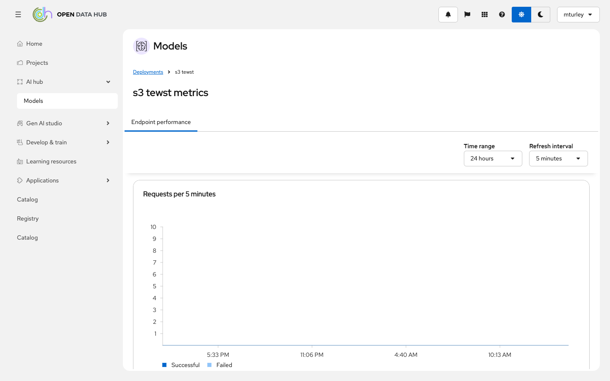

---

## Navigation Sidebar Highlighting

### Models pages — "Models" nav item highlighted
AI hub section expanded, "Models" highlighted with active styling.

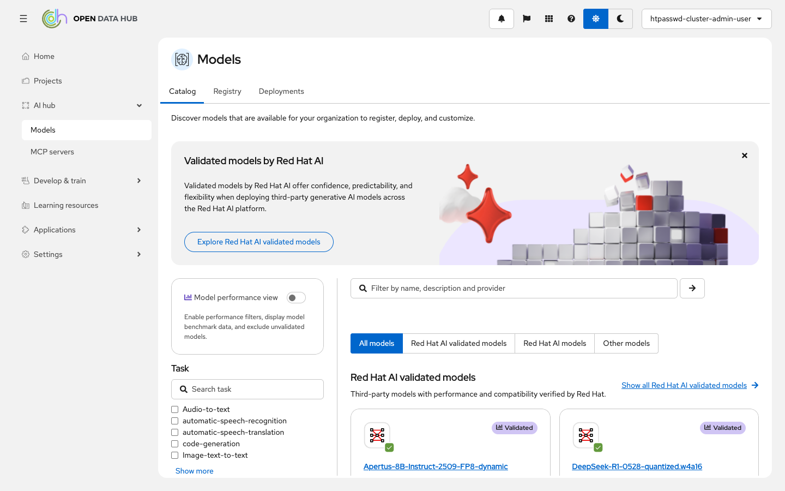

### MCP servers pages — "MCP servers" nav item highlighted
AI hub section expanded, "MCP servers" highlighted with active styling.

---

## Notes

- **Metrics page (screenshot 19)** was captured on a separate cluster that had a deployed model. That cluster did not have the same MCP catalog configuration.
- **Invalid tab redirect** uses session storage for the last-visited tab, so an invalid tab redirects to the previously visited tab rather than always defaulting to the first tab.
- **MCP servers page** on the green-rosa-1 cluster shows "MCP catalog configuration required" since no MCP sources are configured there, but the page and nav highlighting work correctly.
